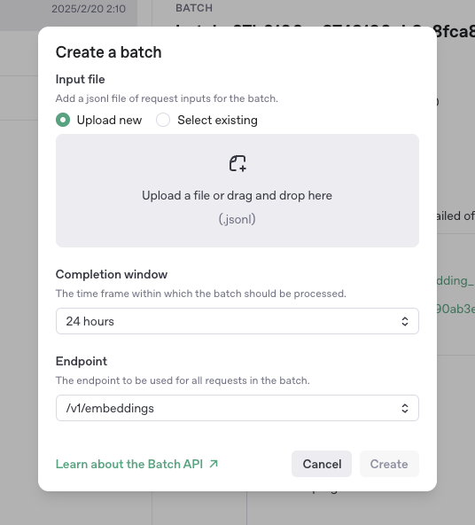
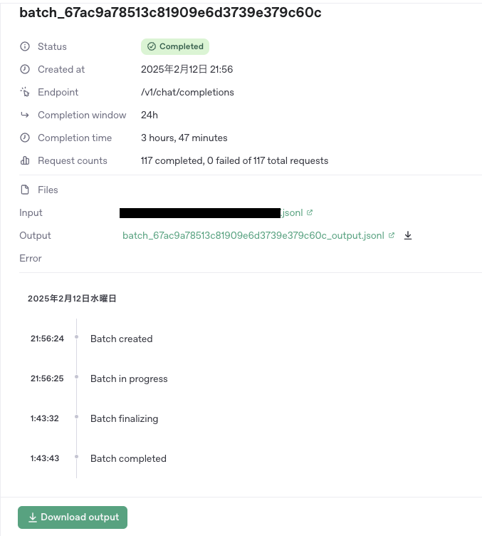

## OpenAIのBatch APIとは
<Bookmark href="https://platform.openai.com/docs/guides/batch" />

OpenAIへのリクエストを非同期で処理し、コストを削減するための機能です。通常のAPIと比較して50%割引となっており、コストパフォーマンスに優れています。

複数のリクエストをJSON Lines（.jsonl）形式のファイルとして書き出して送信し、最大24時間以内に結果の .jsonl ファイルを取得することができます。

公式Docでは以下のようなユースケースが紹介されています。

- 評価の実行
- 大規模データセットの分類
- コンテンツのembedding

今回はRAGを組む際のデータのembeddingに利用しました。
基本的にはリアルタイム性が必要のない利用であればどのような用途でも利用可能だと思います。

### Batch APIの利用手順は以下

1. **入力データの作成**: 処理したいプロンプトをJSON Lines（.jsonl）形式のファイルにまとめます。
2. **ファイルのアップロード**: 作成した.jsonlファイルをOpenAIにアップロードします。
3. **バッチジョブの開始**: アップロードしたファイルに対してバッチ処理を実行するジョブを作成します。
4. **結果の取得**: 処理が完了したら、結果をダウンロードして確認します。

今回はnode.jsを用いてリクエスト用のファイルを作成し、結果を受け取ってDBに保存するまでの処理を紹介しようと思います。

## やったことまとめ

- リクエストをまとめた.jsonlファイルを作成するnode.jsスクリプトを作成
- openAIのBatch APIダッシュボードに.jsonlファイルをアップロード
- 処理が完了するまで最大24時間待機
- openAIのBatch APIダッシュボードから結果の.jsonlファイルをダウンロード
- node.jsスクリプトで結果.jsonlファイルを読み込み、結果をpostgresに格納

### なぜnode.jsを用いたか？

node.jsを利用したアプリの一環で作成したバッチ処理だったためです。prismaクライアントの生のSQLを実行するための `queryRawTyped` を利用しているので、どの言語、DBクライアントを用いても同じだと思います。

Pythonの環境がある場合はPythonでやってしまった方が良いと思います。

### なぜopenAIクライアントの[batchs](https://github.com/openai/openai-node/blob/master/src/resources/batches.ts)を利用しないのか？

最初はリクエスト/レスポンスのファイルの中身を見ながら利用したなと感じたからです。そのうちopenAIクライアント利用に移行すると思います。openAIクライアントを利用するとアプリケーション側ではbatchIdを管理するだけで良くなりそうです。

### 利用モデル

2025/02/22 時点で最もコスパの良さそうな`text-embedding-3-small` を利用しました。

[https://openai.com/ja-JP/index/new-embedding-models-and-api-updates/](https://openai.com/ja-JP/index/new-embedding-models-and-api-updates/)

## 実装紹介

### リクエストをまとめた.jsonlファイルを作成するnode.jsスクリプトを作成

```tsx
import fs from "fs/promises";
import path from "path";

export async function processInput() {
  const dataForEmbedding = ["aaaaaa", "bbbbbb", "cccccc"];

  const requests = dataForEmbedding.map((data, i) => {
    // OpenAI は改行を空白に置換することを奨励している
    const input = data.replace(/\n/g, " ");
    return {
      custom_id: i,
      method: "POST",
      url: "/v1/embeddings",
      body: {
        /** @see https://openai.com/ja-JP/index/new-embedding-models-and-api-updates/ */
        model: "text-embedding-3-small",
        input,
      },
    };
  });

  const filePath = path.resolve(
    __dirname,
    "./openai-batch-data/input/requests_embedding_1.jsonl"
  );
  // requestsをファイルに書き込む
  const fileHandle = await fs.open(filePath, "w");
  const stream = fileHandle.createWriteStream();
  for (const request of requests) {
    stream.write(JSON.stringify(request) + "\n");
  }
  stream.end();
  console.log("requests.jsonl created");
}

processInput()
```

作成されたファイル

```json
{"custom_id":"0","method":"POST","url":"/v1/embeddings","body":{"model":"text-embedding-3-small","input":"aaaaaa"}}
{"custom_id":"1","method":"POST","url":"/v1/embeddings","body":{"model":"text-embedding-3-small","input":"bbbbbb"}}
{"custom_id":"2","method":"POST","url":"/v1/embeddings","body":{"model":"text-embedding-3-small","input":"cccccc"}}
```

### Batch APIダッシュボードに.jsonlファイルをアップロード

[https://platform.openai.com/batches/](https://platform.openai.com/batches/)



embeddingに利用するので Endpointは /v1/embeddings を選択する必要があります。Completion windowは現在 24 hours しか選択できないようです。

アップロード後、処理が完了するまで最大24時間待ちます。

ファイルの大きさやタイミングによると思いますが、自分は3時間かかることもあればが、15分で終わることもあありました。

### Batch APIダッシュボードから結果の.jsonlファイルをダウンロード

処理が完了すると以下のようなUIとなり「Download output」より結果をダウンロードできます



ダウンロードされたファイル

```json
{"id": "batch_req_67b613c5e9188190932e345eb13da6d1", "custom_id": "0", "response": {"status_code": 200, "request_id": "c83d0bac65b0fc758f0217d67426cf63", "body": {"object": "list", "data": [{"object": "embedding", "index": 0, "embedding": [0.022931391, ... ], "model": "text-embedding-3-small", "usage": {"prompt_tokens": 930, "total_tokens": 930}}}, "error": null}
{"id": "batch_req_67b613c7247481909a98dd2762d6a38c", "custom_id": "1", "response": {"status_code": 200, "request_id": "941ebd3de9c6f6cafa5658c708d91c1d", "body": {"object": "list", "data": [{"object": "embedding", "index": 0, "embedding": [-0.007332558, ...], "model": "text-embedding-3-small", "usage": {"prompt_tokens": 294, "total_tokens": 294}}}, "error": null}
{"id": "batch_req_67b613c734388190add5465b04db485a", "custom_id": "2", "response": {"status_code": 200, "request_id": "6ae9f597f1fa88e9b9238ac9a8a9638b", "body": {"object": "list", "data": [{"object": "embedding", "index": 0, "embedding": [0.019804584, ...], "model": "text-embedding-3-small", "usage": {"prompt_tokens": 439, "total_tokens": 439}}}, "error": null}
```

### node.jsスクリプトでダウンロードした.jsonlファイルを読み込み、結果をpostgresに格納

```tsx
import { prisma } from "@gizilog/shared/prisma";
import fs from "fs/promises";
import path from "path";
import { ebeddingBulkInsert } from "@prisma/client/sql";

type BatchResponseJson = {
  id: string;
  custom_id: string;
  response: {
    status_code: 200;
    request_id: string;
    body: {
      id: string;
      object: "list";
      model: "text-embedding-3-small";
      data: [{ object: "embedding"; index: number; embedding: number[] }];
    };
  };
  error: null;
};

export async function output() {
  const filePath = path.resolve(
    __dirname,
    "./openai-batch-data/output/requests_embedding_1.jsonl"
  );
  const content = await fs.readFile(filePath, "utf-8");

  const updates: { id: string; embedding: number[] }[] = [];

  for (const line of content.split("\n")) {
    try {
      const json = JSON.parse(line) as BatchResponseJson;
      const embedding = json.response.body.data[0].embedding;
      updates.push({ id: json.custom_id, embedding });
    } catch (e) {
      console.error(e);
      console.log("line:", line);
    }
  }
  const batchSize = 15; // connection数の上限までまとめてアップロードする
  for (let i = 0; i < updates.length; i += batchSize) {
    const batch = updates.slice(i, i + batchSize);
    // speechid と embedding の配列を Postgres の `UNNEST` に渡す形式に変換
    const speechIds = batch.map((update) => update.id);
    const embeddings = batch.map((update) => JSON.stringify(update.embedding)); // JSON に変換して PostgreSQL 側で `::vector(1536)` にキャスト

    await prisma.$queryRawTyped(
      embeddingBulkInsert(speechIds, embeddings)
    );
  }

  // 処理したoutputファイルを判別するため `.done` ファイルを配置する
  const doneFilePath = filePath + ".done";
  await fs.writeFile(doneFilePath, "");
  console.log("is successfully feeded");
}

```

embeddingBulkInsertのSQLは以下です。

```sql
UPDATE sample_table
SET embedding = embeddings.embedding::vector(1536)
FROM (SELECT UNNEST($1::text[]) AS id, UNNEST($2::vector(1536)[]) AS embedding) AS embeddings
WHERE sample_table.id = embeddings.id;
```

PrismaのTypedSQLを利用する際は以下が参考になります。利用する前に`prisma generate --sql` を実行する必要があります。

<Bookmark href="https://zenn.dev/tockn/articles/0e6eac6220e072" />
