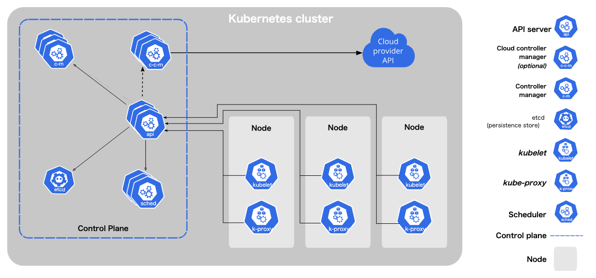

## はじめに  

kubernetesの理解が甘い気がすると漠然と上司に相談したところ、Kubernetes Operatorの自作を勧められたので奮闘した記録です。  
  
  
現在のKubernetesについてのレベル感としては「 [Kubernetes完全ガイド](https://www.amazon.co.jp/Kubernetes%E5%AE%8C%E5%85%A8%E3%82%AC%E3%82%A4%E3%83%89-%E7%AC%AC2%E7%89%88-Top-Gear-%E9%9D%92%E5%B1%B1/dp/4295009792) を辞書代わりに必死に調べながらなんとかな既にあるyamlファイルのチューニングっぽいことができる。」くらいです。  
  
  
api-serverがあり、etcdという永続化層があり、kubectlするとapi-serverが叩かれているということはなんとなく知っているが実態としてどのようにpodたちが管理しているかはあまりわかっていないという状況でした。  
  
  
今思うと、新卒になって買った技術書の中で最も[Kubernetes完全ガイド](https://www.amazon.co.jp/Kubernetes%E5%AE%8C%E5%85%A8%E3%82%AC%E3%82%A4%E3%83%89-%E7%AC%AC2%E7%89%88-Top-Gear-%E9%9D%92%E5%B1%B1/dp/4295009792) を開いている回数が多い気がする（開いている回数は多いが通読して理解しているわけではない🤪）  
  
  
## Kubernetes Operatorとは   
  
  
kubernetesが持つ制御ループという仕組みを使った拡張機能。公式Docの[Operator Pattern](https://kubernetes.io/ja/docs/concepts/extend-kubernetes/operator/)の部分に説明がある。  
  

### 制御ループ (Control Loop, Reconcile Loopとも呼ばれる)  
  
  
常に制御の対象となるものを監視し、理想状態に近づける仕組み。  
  
- Kubernetes Controller内で使われる仕組み。（Kubernetes Controllerはリソースを監視して、登録された理想状態に近づける責務を持っている。 [https://kubernetes.io/ja/docs/concepts/architecture/controller/](https://kubernetes.io/ja/docs/concepts/architecture/controller/)）  
- 「監視 → 分析 → アクション」のサイクルを繰り返し、現実状態（Actual State, Current State）を理想状態（Desired State）に近づける  
- ロボット工学やオートメーション分野で使われている  
  
### Controllerとは  
  
- ControllerはController Managerの中に束ねられている  
- Controllerは一つ以上のリソースを監視  
- Controllerは理想状態と現実状態を近づける責務を持つ  
- 理想状態: API serverから取得したKubernetesオブジェクトのspecフィールド  
- 現実状態: API serverから取得できる実際の状態  
  
KubernetesアーキテクチャにおけるController Manager(c-m)の立ち位置を以下で参考にできます。etcdに保存されている理想状態に関する情報や、実際のNodeの情報をAPI serverを通じて取得している。  
  

  
出展: [https://kubernetes.io/docs/concepts/overview/components/](https://kubernetes.io/docs/concepts/overview/components/)  
  

build-in controller: Controller Managerの中にデフォルトで含まれているController。Deployment, ReplicaSet, Podなどのbuild-in Resourceを管理している  
  
  
### kubectlの内部の動き  
  
1. kuectlコマンドを実行する  
`kubectl create deploy  test —image=nginx —replicas=1`  
2. コマンドをAPI serverに対するPOSTリクエストに変換する  
`POST apis/apps/v1/namaspaces/default/deployments`  
3. API serverがdeploymentのインスタンスを作成し、etcdに保存する（API server自体は保存するだけでReplicaSetの起動等、その先の動作を行わない）  
4. Deployment Controllerの制御ループにより、新たにdeploymentインスタンスが作成されたことを検知し、Deployment Controllerが新たなdeploymentインスタンスに対するReplicaSetを作成する  
5. ReplicaSet Controllerの制御ループにより、新たにreplicaSetインスタンスが作成されたことを検知し、ReplicaSet Controllerが新たなreplicaSetに対するPodを作成する  
  
### Kubernetes Operatorとは（結論）  
  
  
Custom ResourceとCustom Controllerを自分で作成し、Kuberneteのコンセプトに則って自分のロジックを実現する拡張機能。以下の2 stepで作成することができる。  
  
1. APIの拡張: Custom Resourceの定義・追加（ここで作成するCustom Resource DefinitionはCRDと略される）  
2. 制御ループの追加: Custom Controllerの追加  
  
### Operator Hub  
  
  
[https://operatorhub.io/](https://operatorhub.io/)  
  
  
様々なKubernetes Operatorが公開されている。[**prometheus operator**](https://github.com/prometheus-operator/prometheus-operator/tree/main)等、皆さんがよくお世話になっているOperatorについてお調べることができる。  
  
  
### Kubernetes Operatorを使う手順  
  
  
CDRとCustom ControllerのdeployをすることでKubernetes Operatorが使えるようになる。  
  
  
Kubernetes Operatorインストール時にインストールされるリソースは以下。  
  
- CosutmResorceDefinition  
- Deployment(ControllerはDeplymentで実行されることが多い)  
- Controllerへ必要な権限を与えるためのリソース（RBAC）。ServiceAccount, Role(Cluster Role), RoleBiding(Cluster RoleBiding)  
  
## 簡単なKubernetes Operatorを作ってみる  
  
  
### Custom Resourceを作成する  
  
  
sample.crd.yaml  
  
  
```yaml  
apiVersion: apiextensions.k8s.io/v1  
kind: CustomResourceDefinition  
metadata:  
  name: samples.example.com # <names.plural>.<group>  
spec:  
  group: example.com  
  names:  
    kind: Sample  
    plural: samples  
  scope: Namespaced  
  versions:  
    - name: v1alpha1  
      served: true  
      storage: true  
      additionalPrinterColumns:  
        - name: Test String  
          jsonPath: .testString  
          type: string  
      schema:  
        openAPIV3Schema:  
          type: object  
          properties:  
            testString:  
              type: string  
  
```  
  
  
sample.yaml  
  
  
```yaml  
apiVersion: example.com/v1alpha1  
kind: Sample  
metadata:  
  name: sample-resource-1  
testString: "first sample resource"  
```  
  
  
`Sample` crdを作成し、インスタンスを作成する  
  
  
```shell  
❯ kubectl apply -f sample.crd.yaml  
customresourcedefinition.apiextensions.k8s.io/samples.example.com created  
  
❯ kubectl get crd                   
NAME                  CREATED AT  
samples.example.com   2024-12-16T13:30:40Z  
  
❯ kubectl apply -f sample.yaml      
sample.example.com/sample-resource-1 created  
  
❯ kubectl get samples     
NAME                TEST STRING  
sample-resource-1   first sample resource  
  
❯ kubectl get samples sample-resource-1 -o yaml  
apiVersion: example.com/v1alpha1  
kind: Sample  
metadata:  
  annotations:  
    kubectl.kubernetes.io/last-applied-configuration: |  
      {"apiVersion":"example.com/v1alpha1","kind":"Sample","metadata":{"annotations":{},"name":"sample-resource-1","namespace":"default"},"testString":"first sample resource"}  
  creationTimestamp: "2024-12-16T13:30:49Z"  
  generation: 1  
  name: sample-resource-1  
  namespace: default  
  resourceVersion: "14316"  
  uid: a5e9cc5c-b53f-4199-8799-8f6c360b9d30  
testString: first sample resource  
```  
  
  
### Custom Controllerを作成する  
  
  
簡単なControllerのため、1秒に一回制御ループを実行し、custom resourceのオブジェクトの一覧を表示する機能だけを持ちます。  
  
  
```shell  
package main  
  
import (  
	"context"  
	"encoding/json"  
	"flag"  
	"fmt"  
	"path/filepath"  
	"time"  
  
	metav1 "k8s.io/apimachinery/pkg/apis/meta/v1"  
	"k8s.io/apimachinery/pkg/runtime/schema"  
	"k8s.io/client-go/dynamic"  
	"k8s.io/client-go/tools/clientcmd"  
	"k8s.io/client-go/util/homedir"  
)  
  
var gvr = schema.GroupVersionResource{  
	Group:    "example.com",  
	Version:  "v1alpha1",  
	Resource: "samples",  
}  
  
type Sample struct {  
	metav1.TypeMeta   `json:",inline"`  
	metav1.ObjectMeta `json:"metadata,omitempty"`  
  
	TestString string `json:"testString"`  
}  
  
type SampleList struct {  
	metav1.TypeMeta `json:",inline"`  
	metav1.ListMeta `json:"metadata,omitempty"`  
  
	Items []Sample `json:"items"`  
}  
  
func listSamples(client dynamic.Interface, namespace string) (*SampleList, error) {  
	list, err := client.Resource(gvr).Namespace(namespace).List(context.Background(), metav1.ListOptions{})  
	if err != nil {  
		return nil, err  
	}  
  
	data, err := list.MarshalJSON()  
	if err != nil {  
		return nil, err  
	}  
  
	var sampleList SampleList  
	if err := json.Unmarshal(data, &sampleList); err != nil {  
		return nil, err  
	}  
	return &sampleList, nil  
}  
  
func main() {  
	var defaultKubeConfigPath string  
	if home := homedir.HomeDir(); home != "" {  
		// build kubeconfig path from $HOME dir  
		defaultKubeConfigPath = filepath.Join(home, ".kube", "config")  
	}  
  
	kubeconfig := flag.String("kubeconfig", defaultKubeConfigPath, "kubeconfig config file")  
	flag.Parse()  
  
	config, _ := clientcmd.BuildConfigFromFlags("", *kubeconfig)  
  
	client, _ := dynamic.NewForConfig(config)  
  
	for {  
		samples, _ := listSamples(client, "")  
		for i, sample := range samples.Items {  
			namespace := sample.GetNamespace()  
			name := sample.GetName()  
			fmt.Printf("%d\t%s\t%s\n", i, namespace, name)  
		}  
		time.Sleep(1 * time.Second)  
	}  
}  
  
  
```  
  
  
### Next Action  
  
  
今回作成したKubernetes Operatorには以下のような課題があります。  
  
- custom resoruceオブジェクトが作成された場合に実施する、pod作成などのメインロジックが存在しない。  
- ForループはAPI serverへの負荷となってしまう  
- CRDとmain.go内で定義したSample structの整合性担保ができていない  
- Fieldのデフォルト値やバリデーションがない  
- Testコードがない  
- Kubernetesクラスタ上で動かすためには、API Serverへのアクセス管理（RBAC）の考慮が必要  
- …  
  
⇒ これらは全てのKubernetes Operatorを作る際の共通の課題なので、解決のためのライブラリが提供されている。⇒ [**kubebuilder**](https://github.com/kubernetes-sigs/kubebuilder)**などを利用した本格的なKubernetes Operator作成が始まる。**  
  
  
## まとめ  
  
  
なんとなくkubernetesの世界観がわかってきました。今のところアプリケーションレイヤーが本業なのでこれ以上は一旦踏み込めないなと感じています。業務でよく利用されている [prometheus](https://github.com/prometheus-operator/prometheus-operator)や[argo-rollouts](https://argo-rollouts.readthedocs.io/)などのkubernetes operatorのドキュメント等が読みやすくなったのがとても良いなと思います。  
  
  
### 参考  
  
- [**オペレーターパターン**](https://kubernetes.io/ja/docs/concepts/extend-kubernetes/operator/)  
- [**Kubernetes Operator 超入門/Kubernetes_Operator_Introduction**](https://speakerdeck.com/oracle4engineer/kubernetes-operator-introduction)  
- [**OSC2020 Online Fukuoka Kubernetes Operator Intuition**](https://speakerdeck.com/nwiizo/osc2020-online-fukuoka-kubernetes-operator-intuition)  
- 以下の動画は超絶おすすめです。本記事もこちらの動画の流れに沿った内容となっていますm  
  
	<Bookmark href="https://www.udemy.com/course/kubernetes-operator-basics/" />
  
  
	repository: [https://github.com/nakamasato/kubernetes-operator-basics/tree/main](https://github.com/nakamasato/kubernetes-operator-basics/tree/main)  
  
