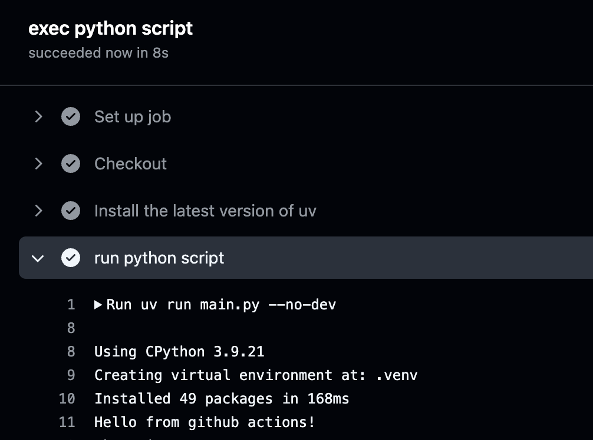

  
uvでプロジェクト管理しているPythonスクリプトをGitHub Actionsで実行する環境を整えたので紹介します。  
  
  
Github Actionsは無料でちょっとしたスクリプトの定期実行にとても便利なので重宝しています。  
  
  
今回はChatGPT apiを定期的に叩くタスクを想定して、OpenAIのAPI KeyをGithub Secretsに格納して参照することろまで解説します。  
  
  
## プロジェクト概要  
  
ディレクトリ構造  
  
  
```shell  
~/py-batch   
❯ tree -L 1 -a  
.  
├── .python-version  
├── .venv  
├── main.py  
├── pyproject.toml  
└── uv.lock  
```  
  
  
pyproject.toml  
  
  
```shell  
[project]  
name = "py-batch"  
version = "0.1.0"  
requires-python = ">=3.9"  
dependencies = [  
    "langchain>=0.3.14",  
    "openai>=1.59.6",  
]  
  
[dependency-groups]  
dev = [  
    "transformers>=4.47.1",  
]  
```  
  
  
main.py  
  
  
```shell  
import os  
  
API_KEY = os.environ.get("API_KEY")  
  
print("Hello from github actions!")  
```  
  
  
## 利用する setup テンプレート  
  
  
uvの開発元であるAstral社が以下でgithub actions用のsetupを提供しているのでこちらを利用します。  
  
  
[https://github.com/astral-sh/setup-uv](https://github.com/astral-sh/setup-uv)  
  
  
## ワークフローyaml全体  
  
  
コード全体は以下になります。  
  
  
```yaml  
name: py-batch  
on:  
  workflow_dispatch:  
on:  
  schedule:  
    - cron: "0 0 * * *" # 毎日 0時 に実行  
jobs:  
  command:  
    name: exec python script  
    runs-on: ubuntu-latest  
    steps:  
      - name: Checkout  
        uses: actions/checkout@v4  
      - name: Install the latest version of uv  
        uses: astral-sh/setup-uv@v5  
        with:  
          version: "latest"  
      - name: run python script  
        env:  
          OPENAI_API_KEY: ${{ secrets.OPENAI_API_KEY }}  
        run: uv run main.py  
```  
  
  
actions/checkout stepでコードをcloneし、 astral-sh/setup-uv stepを入れることで簡単にuv環境を整えることができます。  
  
  
astral-sh/setup-uv を用いている場合、GitHub Actions上でpython環境を整える際によく利用する [actions/setup-python](https://github.com/actions/setup-python) をstepに加える必要はないようです。  
Pythonのバージョンを指定してたい場合は、uvコマンド経由で指定することが可能です。  
  
  
```yaml  
- name: Install the latest version of uv  
  uses: astral-sh/setup-uv@v5  
  with:  
    enable-cache: true  
- name: Install Python 3.12  
  run: uv python install 3.12  
```  
  
  
無事実行することができました  


  
### 最後に  
  
  
雑談ですがuvの環境を整えていて思ったこと↓  
  
<TweetEmbed url="https://x.com/soken_nowi/status/1877913565216284972" />  
  
  
以下のようにあるのでnode.jsプロジェクトにおける`npm install`的なstepを踏まなくて良いのは便利だなと  
  
  
> When used in a project, the project environment will be created and updated before invoking the command.  
  
  
[https://docs.astral.sh/uv/reference/cli/#uv-run](https://docs.astral.sh/uv/reference/cli/#uv-run)  
  
