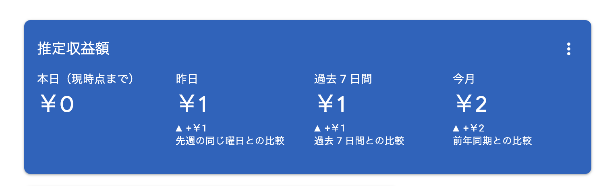

本ブログの今月の収益🎉  
  
  
  
今年の7月あたりから個人ブログの作成を少しづつ始め、Google Adsenseの審査に通り、0→1 を達成することができたので、やったことをまとめてみます。  
  
  
⚠️ ジュニアエンジニアが自分自身の成長のために作成したブログでたまたま収益が1円になっただけです。ブログでたくさん稼ぎたい方にとってはあまり参考になる内容はないと思いますm  
自分自身の継続のためにも好奇心で Google Adsense の審査を出すと通ったので、少しだけ広告を入れさせてもらっている状況です。  
  
  
# まとめ  
  
- Next.jsでブログを構築した  
	- notionで記事を書き、github actionの定期実行から notion api経由でmdファイルを保存することで記事を管理している  
	- notionの画像データのURLは、notionの仕様によるものなのかがすぐにURLが変わってリンク切れしてしまうため、画像データはbase64エンコードしてmdファイル内に含めた  
	- その他、TOCの自動生成、ダークモード、rssフィードなど普通のブログにありそうな機能を実装した  
- ホスティング先はNetlifyの無料プラン（Vercelの無料プランだと広告を載せられない）  
- CMSにnotion, ホスティングにNetlifyという構成なので、ドメイン取得料以外は無料  
  
# 個人ブログを作ろうと思った背景  
  
- 勉強したことのアウトプットを形として残しておきたい  
	- ブログを始めると、ネタ作りのためにも勉強意欲になる  
	- いつか転職を検討する際に役立つかも  
- つよつよで影響力のあるエンジニアは個人ブログを持っていることが多い  
- 仕様書や技術的なドキュメントを作成する際の文章力を鍛えたい（かっこよく言えばテクニカルライティング）  
- Next.jsで何か作りたい  
  
# やったこと  
  
  
## Next.jsでブログのベース機能の作成  
  
  
### contentlayerによるmdファイルには管理  
  
  
公式doc: [https://contentlayer.dev/docs](https://contentlayer.dev/docs)  
  
  
参考記事:  
  

<Bookmark href="https://zenn.dev/you_5805/articles/contentlayer" />
  
設定ファイルは以下  
  
  
```typescript  
// contentlayer.config.ts  
import { defineDocumentType, makeSource } from "contentlayer/source-files";  
import { remark } from "remark";  
import strip from "strip-markdown";  
export const Post = defineDocumentType(() => ({  
  name: "Post",  
  filePathPattern: `*.md`,  
  fields: {  
    title: { type: "string", required: true },  
    date: { type: "string", required: true },  
    updatedAt: { type: "string", required: false },  
    tags: { type: "list", of: { type: "string" }, required: true },  
    isDeleted: { type: "boolean", required: false },  
    isPublished: { type: "boolean", required: false },  
    publishedAt: { type: "string", required: false },  
    views: { type: "number", required: false },  
  },  
  computedFields: {  
    url: {  
      type: "string",  
      resolve: (post) => `/posts/${post._raw.flattenedPath}`,  
    },  
    slug: {  
      type: "string",  
      resolve: (post) => post._raw.sourceFileName.replace(/\.md$/, ""),  
    }  
  },  
}));  
  
export default makeSource({  
  contentDirPath: "../contents",  
  documentTypes: [Post],  
});  
```  
  
  
### react-markdownとreact-syntax-highlighterによるレンダリング  
  
  
公式doc: [https://github.com/remarkjs/react-markdown](https://github.com/remarkjs/react-markdown)  
  
  
```typescript  
import ReactMarkdown from "react-markdown";  
import remarkGfm from "remark-gfm";  
import rehypeSlug from "rehype-slug";  
import rehypeRaw from "rehype-raw";  
import { Prism as SyntaxHighlighter } from "react-syntax-highlighter";  
import { oneDark } from "react-syntax-highlighter/dist/cjs/styles/prism";  
  
  
<ReactMarkdown  
  className="post prose dark:prose-invert"  
  urlTransform={(value: string) => value} // base64形式の画像に対応 ref. https://github.com/remarkjs/react-markdown/issues/774  
  rehypePlugins={[rehypeRaw, rehypeSlug]}  
  remarkPlugins={[remarkGfm]}  
  components={{  
    p: Paragraph,  
    code: ({ node, className, children, style, ref, ...props }) => {  
      const match = /language-(\w+)/.exec(className || "");  
      return match ? (  
        <SyntaxHighlighter  
          language={match[1]}  
          PreTag="div"  
          {...props}  
          style={oneDark}  
        >  
          {String(children).replace(/\n$/, "")}  
        </SyntaxHighlighter>  
      ) : (  
        <code className={className} {...props}>  
          {children}  
        </code>  
      );  
    },  
  }}  
>  
  {post.body.raw}  
</ReactMarkdown>  
```  
  
  
[react-markdwon](https://github.com/remarkjs/react-markdown)でのレンダリングでは base64形式で画像を指定する `data:` protocol はセキュリティの観点からデフォルトでサポート対象のため、以下のようにurlTransformを上書きする必要があります  
  
  
ref: [https://github.com/remarkjs/react-markdown/issues/774](https://github.com/remarkjs/react-markdown/issues/774)  
  
  
```typescript  
<ReactMarkdown  
  className="post prose dark:prose-invert"  
  urlTransform={(value: string) => value} // base64形式の画像に対応  
/>       
```  
  
  
### TOCの追加  
  
  
公式doc: [https://tscanlin.github.io/tocbot/](https://tscanlin.github.io/tocbot/)  
  
  
参考記事:   
  
  
<Bookmark href="https://zenn.dev/yyykms123/articles/2023-12-03-adding-toc-to-nextjs-blog-using-tocbot" />

  
実装は以下  
  
  
```typescript  
"use client";  
  
import { useEffect } from "react";  
import tocbot from "tocbot";  
  
export const PcToc: React.FC = () => {  
  useEffect(() => {  
    tocbot.init({  
      tocSelector: ".toc",  
      contentSelector: ".post", // 目次を抽出したい要素のクラス名  
      headingSelector: "h1, h2, h3",  
      scrollSmoothOffset: -60,  
      headingsOffset: 60,  
      scrollSmoothDuration: 300,  
    });  
  
    return () => tocbot.destroy();  
  }, []);  
  
  return (  
    <div className="sticky top-0">  
      <h2 className="text-xl border-l-4 pl-1">目次</h2>  
      <div className="toc px-0 pb-8 text-base"></div>  
    </div>  
  );  
};  
```  
  
  
### next/ogによるOGPの画像の自動生成  
  
  
公式doc: [https://github.com/vercel/next.js](https://github.com/vercel/next.js)  
  
  
参考:   
  
  
<Bookmark href="https://nextjs.org/docs/app/api-reference/file-conventions/metadata/opengraph-image" />
  
  
実装（style部分は長くなるため省略）  
  
  
```typescript  
import path from "path";  
import { ImageResponse } from "next/og";  
  
const assetsDirectory = process.cwd() + "/assets";  
  
export const size = {  
  width: 1200,  
  height: 630,  
};  
  
export const contentType = "image/png";  
  
export default async function Image({ params }: { params: { slug: string } }) {  
  const post = getPost(params.slug);  
  
  if (!post) return new Response("Not Found", { status: 404 });  
  
  const fontInter = await fs.readFile(  
    path.join(assetsDirectory, "Inter-Bold.ttf")  
  );  
  const fontNotSansJP = await fs.readFile(  
    path.join(assetsDirectory, "NotoSansJP-Bold.ttf")  
  );  
  
  return new ImageResponse(  
    (  
      <div lang="ja-JP">  
        <div>{post.title}</div>  
        <div>{SITE_TITLE}</div>  
      </div>  
    ),  
    {  
      width: 1200,  
      height: 630,  
      fonts: [  
        {  
          name: "Inter",  
          data: fontInter,  
          style: "normal",  
          weight: 700,  
        },  
        {  
          name: "NotoSansJP",  
          data: fontNotSansJP,  
          style: "normal",  
          weight: 700,  
        },  
      ],  
    }  
  );  
}  
  
```  
  
  
## notionとgithub action定期実行でCMS機能の作成  
  
  
### そもそもなぜnotionなのか？  
  
  
notionならスマホからでも気軽に書くことができ、記事の更新を継続できそうと思ったから。  
  
  
他のCMSでブログ構築を試みた経験がありますが、ブログのためだけにCMSを開くのが億劫で更新できなくなりました。普段使いしているnotionをデータソースとするとブログの更新が継続できるかもと思い、無理やりnotionを採用しました。  
  
  
### 実現方法  
  
  
notion apiはすぐにリクエスト量制限に達するので、都度取得できません。定期実行（1日に2回）でmdファイルに変換したものをリポジトリに保存しておき、build時にリポジトリにあるmdファイルを読み込んでブログを構築しています。  
  
  
最終的なマスターデータはリポジトリに保存されるmdファイルとなるので、細かい修正などは直接mdファイルをいじったりもしています。  
  
  
github actionsの設定yaml  
  
  
```typescript  
name: update-contents  
on:  
  push:  
    branches: [main]  
  schedule:  
    - cron: "0 4,14 * * *" # 毎日 4時、14時 に実行  
# ワークフローに書き込み権限を与える ref:https://docs.github.com/en/actions/using-jobs/assigning-permissions-to-jobs  
permissions:  
  contents: write  
jobs:  
  command:  
    name: Use Linux commands  
    runs-on: ubuntu-latest  
    steps:  
      - name: Checkout  
        uses: actions/checkout@v4  
      - name: Use Node.js  
        uses: actions/setup-node@v4  
        with:  
          node-version: 20  
          cache: "npm"  
      - name: build application  
        working-directory: packages/gha-worker  
        run: npm ci && npm run build  
      - name: run notion fetch  
        working-directory: packages/gha-worker  
        env:  
          NOTION_API_KEY: ${{ secrets.NOTION_API_KEY }}  
          NOTION_DATABASE_ID: ${{ secrets.NOTION_DATABASE_ID }}  
          GITHUB_WORKSPACE: $GITHUB_WORKSPACE  
        run: node dist/notion-fetch/index.js  
      - name: diff # run notion fetch タスクでファイルの更新が存在するかをgit diffで確認し、commitとpushを行う  
        id: diff  
        run: |  
          git add -N .  
          git diff --name-only --exit-code  
        continue-on-error: true  
      - name: update contents_last_updated.tag  
        working-directory: packages/gha-worker  
        run: node dist/update-tag/index.js  
        if: steps.diff.outcome == 'failure'  
      - name: commit and push  
        env:  
          GITHUB_TOKEN: ${{ secrets.GITHUB_TOKEN }}  
        run: |  
          set -x  
          git config --local user.email "github-actions[bot]@users.noreply.github.com"  
          git config --local user.name "github-actions[bot]"  
          DATETIME=$(date +"%Y-%m-%d %H:%M:%S")  
          git add .  
          git commit -m "[$DATETIME] update notion blog content by bot"  
          git push origin main  
        if: steps.diff.outcome == 'failure'  
  
```  
  
  
run notion fetch タスクの処理の概要  
  
  
```typescript  
  
import * as core from '@actions/core'  
import { writeFile } from 'fs/promises'  
  
  
export async function run() {  
  try {  
    const notionApiKey = process.env.NOTION_API_KEY ?? 'undefined'  
    const databaseId = process.env.NOTION_DATABASE_ID ?? 'undefined'  
    const notionClient = new NotionClient(notionApiKey)  
  
    // 記事一覧を取得する  
    const posts = await notionClient.getUpdatedDatabase(databaseId)  
  
    // notion api のリクエスト制限を避けるため、5秒スリープする  
    await new Promise(resolve => setTimeout(resolve, 5000))  
  
    const feedItems: Post[] = posts.map(postFromNotionResponse)  
  
    const filterdFeedItems = feedItems.filter(  
      item => isWithin6Hours(item.lastEditedDate) && item.slug // slugが存在しない場合もfilterする  
    )  
  
    const contentsPath = process.env.GITHUB_WORKSPACE + '/contents'  
  
    for (const feedItem of filterdFeedItems) {  
      // 記事をmarkdown形式で取得する  
      const mdString = await notionClient.getMdString(feedItem.id)  
      const mdContents = attachMdMetadata(feedItem, mdString)  
        
      // ファイルを書き込む  
      await writeFile(`${contentsPath}/${feedItem.slug}.md`, mdContents, 'utf8')  
  
      core.info(`  
        Successfully updated below md files  
        title: ${feedItem.title}  
        slug: ${feedItem.slug}  
        id: ${feedItem.id}  
      `)  
  
      // notion api のリクエスト制限を避けるため、5秒スリープする  
      await new Promise(resolve => setTimeout(resolve, 5000))  
    }  
  } catch (err) {  
    console.log(err)  
  }  
}  
```  
  
  
### notionの画像をmdファイルに変換する際の注意点  
  
  
notionの画像データのURLは、notionの仕様によるものなのかがすぐにURLが変わってリンク切れしてしまう  
  
  
⇒ [notion-to-md](https://github.com/souvikinator/notion-to-md)でmd変換する際に画像をbase64変換することで対応 ref: [https://github.com/souvikinator/notion-to-md/pull/81/files](https://github.com/souvikinator/notion-to-md/pull/81/files)  
  
  
```typescript  
import { Client } from '@notionhq/client'  
import { NotionToMarkdown } from 'notion-to-md'  
  
  
const n2m = new NotionToMarkdown({  
  notionClient: new Client({  
      auth: notionToken,  
      timeoutMs: 1000  
  }),  
  config: {  
    convertImagesToBase64: true  
  }  
})  
```  
  
  
## 最後に  
  
  
わざわざnotion apiを利用せずに、mdファイルを直接いじる運用でも良い気がしている。  
  
  
以下の機能がVS Codeに追加されてからは画像の扱いもかなり楽になったので、そのうちnotion api利用は終わりそう。  
  
  
<Bookmark href="https://zenn.dev/roboin/articles/1fa72705ff2e03" />
  
  
また、（1円ととても少ないが）収益をブログから得るにあたって、業務で得た知識との棲み分けが難しいなと感じる。業務で得た知識は会社に帰属する認識でブログで利用するつもりはないが、業務きっかけて興味を持ち、プライベートの時間に深掘った技術をどこまでアウトプットすべきなのかが難しいところ。。。  
  
  
「業務と業務時間外の勉強の境目が曖昧」 = 「会社の資産と自分の資産が曖昧」な状態なので同業の方はどのように捉えているのかとても気になる  
  
