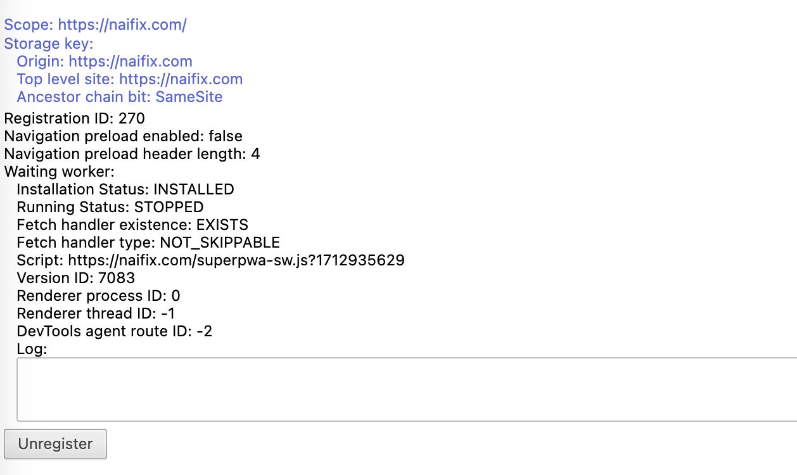
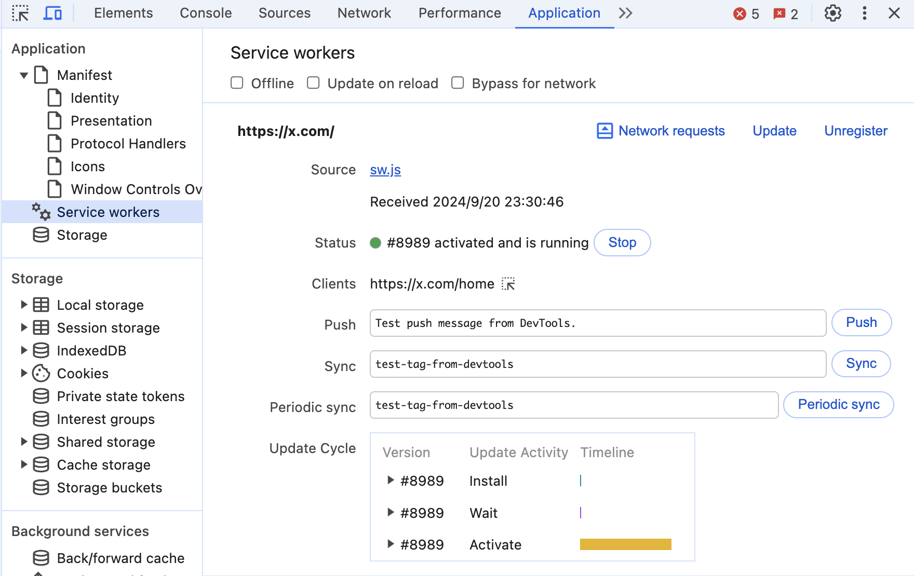

  
# はじめに  

  
Next.js (app router) にてPush通知を実現してみた記録をまとめます。  
  
  
Push通知を実現するための技術である、サービスワーカーとその応用のPWAについても気になったので少し言及しています。  
  
  
実装の大部分は以下のNext.jsの公式ドキュメントに基づいています。  
  
<Bookmark href="https://nextjs.org/docs/app/building-your-application/configuring/progressive-web-apps" />
  
# ブラウザのサービスワーカーとは  
  
  
通知を受け取りユーザーに表示するためには、ブラウザのサービスワーカー機能を利用する必要があるとのこと。  
  
  
以下の記事がとても参考になる。  
  
<Bookmark href="https://zenn.dev/s_takashi/articles/b01980461f3b21" />
  
  
以下は明示的にサービスワーカースクリプトをブラウザにダウロードさせる例。  
  
  
```javascript  
const registration = await navigator.serviceWorker.register('/sw.js', {  
	scope: '/',  
})  
```  

ダウンロードしたサービスワーカースクリプトがバックグラウンドで実行され、通知をキャッチしてさばくという仕組み。  
  
一度ダウンロードするとオフラインでも実行可能。オフラインでも動くこのような仕組みをキャッシュなどに利用するのがPWAらしい。  
  
サービスワーカーはブラウザの実行環境と異なり、以下のapiが利用できるらしい。ページ読み込み前から動いてくれるスクリプトなので当然だが、DOMにアクセスできなかったり、windowオブジェクトなどは利用できないので注意が必要。  
  
  
<Bookmark href="https://developer.mozilla.org/ja/docs/Web/API/Service_Worker_API" />
  
以下のchromeのservice worker設定画面（**chrome://serviceworker-internals/**）から確認、unregisterすることができる  
  

  
また、検証画面からUnregisterすることもできます。画像の「Update on reload」にチェックを入れておくと、リロードの度にサービスワーカーが更新されるようになり、デバッグが捗ったのでおすすめです。  
  

  
# Next.jsでブラウザ通知を実装する  
  
  
## 通知を受け取るサービスワーカーを作成する  
  
  
public/sw.js  
  
  
```javascript  
self.addEventListener("push", function (event) {  
  if (event.data) {  
    const data = event.data.json();  
    const options = {  
      body: data.body,  
      icon: data.icon || "/favicon.png",  
      badge: "/favicon.png",  
      vibrate: [100, 50, 100],  
      data: {  
        dateOfArrival: Date.now(),  
        primaryKey: "2",  
      },  
    };  
    event.waitUntil(self.registration.showNotification(data.title, options));  
  }  
});  
```  
  
  
pushイベントをevent listenerを作成し、通知を作成する [showNotification](https://developer.mozilla.org/ja/docs/Web/API/ServiceWorkerRegistration/showNotification) メソッドで端末に通知を表示しています。  
  
  
## サービスワーカーを登録し、通知管理のsubscriptionをステートに格納する  
  
  
```javascript  
  async function registerServiceWorker() {  
    const registration = await navigator.serviceWorker.register("/sw.js", {  
      scope: "/",  
      updateViaCache: "none",  
    });  
    const sub = await registration.pushManager.getSubscription();  
    setSubscription(sub);  
  }  
```  
  
  
registerメソッドの返り値は以下のServiceWorkerRegistrationを返す。  
  
  
<Bookmark href="https://developer.mozilla.org/ja/docs/Web/API/ServiceWorkerRegistration" />
  
  
こちらのServiceWorkerRegistrationからプッシュ通知の許可状況へのアクセスなど、プッシュ通知の購読を管理するための [`PushManager`](https://developer.mozilla.org/ja/docs/Web/API/PushManager) へアクセスすることができる。こちらの PushManagerから取得できる [`PushSubscription`](https://developer.mozilla.org/ja/docs/Web/API/PushSubscription) インスタンスはプッシュ通知を送る際に利用するのでstateに格納しておく。  
  
  
ちなみに、サービスワーカーを登録する際はブラウザの通知権限を求める必要があり、自分は以下のように管理しています。  
  
  
```typescript  
  useEffect(() => {  
    requestPermission().then((permission) => {  
      // 通知の権限がある場合のみ先ほどのregisterServiceWokerを実効する  
      if (permission) registerServiceWorker();  
    });  
  }, []);  
  
  async function requestPermission() {  
    if (  
      "serviceWorker" in navigator &&  
      "PushManager" in window &&  
      "Notification" in window  
    ) {  
      // 現在の通知権限の状態をチェック  
      if (Notification.permission === "granted") {  
        return true;  
      } else if (Notification.permission === "default") {  
        // 通知権限がまだ許可されていない場合、許可をリクエスト  
        Notification.requestPermission().then((permission) => {  
          if (permission === "granted") return true;  
        });  
      } else {  
        // Notification.permission === "denied" の場合、手動で権限を許可してもらう必要がある  
        setAlert(  
          "通知権限が拒否されています。ブラウザの設定より手動で通知を許可してください"  
        );  
      }  
    } else {  
      setAlert("このブラウザは通知をサポートしていません。");  
    }  
    return false;  
  }  
```  
  
  
通知権限の状態については以下をの公式Docを参考に実装しました。  
  
  
<Bookmark href="https://developer.mozilla.org/ja/docs/Web/API/Notification/requestPermission_static" />
  
  
また、参考までに ーカルでで動作確認する場合はhttpsである必要があるので、 `next dev --experimental-https` を利用する必要があます。  
  
  
## 通知を送る（server action）  
  
  
最後に、取得したsubscriptionの情報を用いて通知を実装に送信する部分を作成しました。通知送信部分は[server action](https://react.dev/reference/rsc/server-actions)を利用します。  
  
  
web-push 送信部分の詳細は以下のREADME.meなどを参照ください。 [VAPID](https://vapidkeys.com/) などを事前に登録しておく必要があります。  
  
  
<Bookmark href="https://www.npmjs.com/package/web-push" />
  
  
```javascript  
"use server";  
  
import webpush, { PushSubscription } from "web-push";  
  
webpush.setVapidDetails(  
  "mailto:example@gmail.com",  
  process.env.NEXT_PUBLIC_VAPID_PUBLIC_KEY!,  
  process.env.VAPID_PRIVATE_KEY!  
);  
  
  
export async function sendNotification(message: string) {  
  if (!subscription) {  
    throw new Error("No subscription available");  
  }  
  
  try {  
    await webpush.sendNotification(  
      subscription,  
      JSON.stringify({  
        title: "Test Notification",  
        body: message,  
        icon: "/favicon.png",  
      })  
    );  
    return { success: true };  
  } catch (error) {  
    console.error("Error sending push notification:", error);  
    return { success: false, error: "Failed to send notification" };  
  }  
}  
```  
  
  
本サイトの以下labsにて動作している部分を確認できます。  
  
  
[https://sokes-nook.net/blog/next-web-push](https://sokes-nook.net/blog/next-web-push)  
  
  
chromeの場合、送信した通知の履歴等は以下から確認することができる。  
  
  
chrome://gcm-internals/  
  
  
## PWAの現状について  
  
  
PWA(Progressive Web Applications) は、ウェブアプリケーションのリーチとアクセス性を持ちながら、ネイティブモバイルアプリの機能とユーザー体験を組み合わせたものです。  
  
- アプリストアの承認を待たずに、すぐに更新をデプロイできる  
- 単一のコードベースでクロスプラットフォームアプリケーションを作成できる  
- ホーム画面へのインストールやプッシュ通知など、ネイティブのような機能を提供できる  
  
Next.js においては、[manifest](https://nextjs.org/docs/app/api-reference/file-conventions/metadata/manifest)を適切に作成してサービスワーカーを配置するとPWAとして動かすことができます。  
  
  
本サイトも通知権限を付与してかつ、ブラウザのホームに追加いただくとPWAとして動くようになると思います。  
  
  
しかし、実態としてブラウザ通知やサービスワーカは以下で報告されているように詐欺などに利用されるケースが多くあり、ユーザー側が積極的に許可する状況ではありません。肌感覚的には、「何か謎の通知が要求されたが、よくわからないのでとりあえず拒否。」というユーザーが多いと感じており、アプリほどリーチとアクセス性を実現できないと思います。  
  
  
実際にプロダクトに導入してリターンが見込めるかはしっかり検討が必要な段階ということです。  
  
  
<Bookmark href="https://www.ipa.go.jp/security/anshin/attention/2021/mgdayori20210309.html" />
  
  
しかし、技術としてはとても素敵だなと思いますし、日々進化していると実感しています。最後にPWAを導入する際に参考になりそうなサイトを置いておきます。  
  
- 現在PWAができることは以下サイトにまとめられている  
  
  <Bookmark href="https://whatpwacando.today/" />
  
- Next.jsの公式ドキュメントにて言及されている [serwist](https://github.com/serwist/serwist) を利用したPWAを作成しているブログ  
  
  <Bookmark href="https://javascript.plainenglish.io/building-a-progressive-web-app-pwa-in-next-js-with-serwist-next-pwa-successor-94e05cb418d7" />
  
- serwistのフォーク元であるworkboxを利用している以下の一休.comの事例  
  
  <Bookmark href="https://user-first.ikyu.co.jp/entry/2019/12/02/080000" />
  
