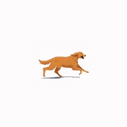

  
# H1 heading  
testtest

## H2 heading  
  
  
### H3 heading  
  
- list1  
- list2  
- list3  
1. number1  
2. number2  
3. number3  
- ネスト1  
	- ネスト2  
		- ネスト3  
  
> this is quote message  
  
  
```text  
const a = "aaa"  
const b = "bbb"  
const list = [a, b]  
```  
  
  
これは**太文字**です  
  
  
これは`インラインコード`です  
  
  
これは_イタリック_です  
  
  
これは<u>アンダーライン</u>です  
  
  
これは<u>取り消し線</u>です  
  
- [ ] TODO1  
- [ ] TODO2  
- [x] TODO3  
  
以下はブックマーク  
    
<Bookmark href="https://zenn.dev/mizchi/articles/remix-cloudflare-pages-supabase"/>
  
以下はリンク
  
[https://zenn.dev/mizchi/articles/remix-cloudflare-pages-supabase](https://zenn.dev/mizchi/articles/remix-cloudflare-pages-supabase)  
  
  
以下はdivider  
  
---  
  
> 💡 これはcalloutです  
  
Twitter Embedテスト  
  
<TweetEmbed url="https://twitter.com/elonmusk/status/1834213015857889706" />
  
  
YouTube Embedテスト  
  
<YouTubeEmbed url="https://www.youtube.com/watch?v=CmDv7ww6ikU" />  
  
本ブログのBookmark  
oepngraph-imageのテストも含む  
  
  
<Bookmark href="https://sokes-nook.net/blog/next-web-push" siteUrl="https://sokes-nook.net" />

  

以下はpng画像


以下はjpg画像


以下はgif画像


以下はsvg画像

