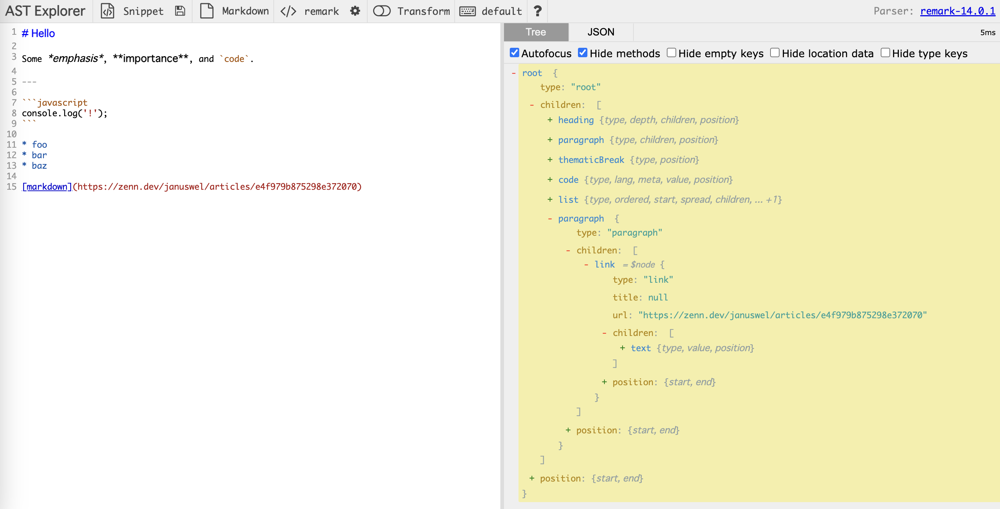

  
## はじめに  
  
本ブログは2024/09/14現在では、Next.js, contentlayer, markdownを用いて構築しています。
記事はnotionで書いたものをnotion apiを定期実行で叩くことでmarkdownとして取得し保存しています。  
  
notion apiからページ内容を取得しMarkdownに変換する処理は [notion-to-md](https://github.com/souvikinator/notion-to-md) を用いて行なっています。  

こちらライブラリでは、notionのBookmarkを以下のようなmdに変換します。  
  
```markdown  
[bookmark](https://zenn.dev/januswel/articles/e4f979b875298e372070)   
```  

デフォルトのmarkdownレンダラーを利用する場合、リンクテキストが”bookmark”のリンクとして解釈されてしまいます。  

こちらのbookmarkを独自に解釈してブックマークとして表示する unifiedプラグインを作成したので紹介します。  


## unifiedについて
markdownを自分の思った通りに描画しようとした場合、[unified](https://github.com/unifiedjs/unified)というエコシステムを利用することが不可避でした。  
  
unified では mdast（Markdown の AST）を構築し、hast （HTML の AST）に変換して、htmlを出力するという手順で動いており、ASTの扱いを把握する必要がありました。  
  
unifiedの理解については [@janus_wel](https://x.com/janus_wel)さんのzennにおける以下連載がとても参考になりました。  
  
- [**unified を使う前準備**](https://zenn.dev/januswel/articles/e4f979b875298e372070)  
- [**unified におけるプラグインまとめ**](https://zenn.dev/januswel/articles/44801708e8c7fdd358e6)  
- [**unified を使って Markdown を拡張する**](https://zenn.dev/januswel/articles/745787422d425b01e0c1)  
- [**unified を使ってオレオレ Markdown を ReactElement に変換する**](https://zenn.dev/januswel/articles/c0e663c88b562bfde8ff)  
  
こちらで解説されている内容は前提として本編が構成されているため、前もっての一読をお勧めします。  
  
また、qiitaの以下記事もわかりやすかったのでお勧めです。  
  
[**Next.js のための Remark / Rehype 入門**](https://qiita.com/sankentou/items/f8eadb5722f3b39bbbf8)  
  
## 実装  
  
  
```typescript  
import { unified } from "unified";  
import remarkParse from "remark-parse";  
import remark2rehype from "remark-rehype";  
import rehypeStringify from "rehype-stringify";  
import { Node, Parent } from "unist";  
import { VFileCompatible } from "vfile";  
import { visit } from "unist-util-visit";  
import { Paragraph } from "mdast";  
import { Handler } from "mdast-util-to-hast";  
  
const testMdString = `  
# test markdown  
  
以下はnotionのブックマーク    
  
[bookmark](https://zenn.dev/mizchi/articles/remix-cloudflare-pages-supabase)    
    
`;  
  
function isObject(target: unknown): target is { [key: string]: unknown } {  
  return typeof target === "object" && target !== null;  
}  
  
// https://github.com/syntax-tree/unist#parent  
function isParent(node: unknown): node is Parent {  
  return isObject(node) && Array.isArray(node.children);  
}  
  
const notionBookmarkPlugin = () => {  
  return (tree: Node, _file: VFileCompatible) => {  
    visit(  
      tree,  
      "paragraph",  
      (node: Paragraph, index: number, parent: Parent | undefined) => {  
        if (!isParent(parent)) {  
          return;  
        }  
  
        if (node.children[0].type === "link") {  
          const linkNode = node.children[0];  
          if (linkNode.children[0].type === "text") {  
            const textNode = linkNode.children[0];  
            if (textNode.value === "bookmark") {  
              // my-bookmarkという新たなtypeのnodeを作成する  
              parent.children[index] = {  
                type: "my-bookmark",  
                //@ts-ignore  
                children: [{ type: "text", value: linkNode.url }],  
                data: { linkUrl: linkNode.url },  
              };  
            }  
          }  
        }  
      }  
    );  
  };  
};  
  
// @ts-ignore  
// my-bookmark typeのnodeをhtmlへ変換する際のhandler  
const myBookmarkHandler: Handler = (state, node, parent) => {  
  return {  
    type: "element",  
    tagName: "a",  
    properties: {  
      className: "",  
      href: node.data.linkUrl,  
      target: "_blank",  
      rel: "noreferrer",  
    },  
    children: [  
      {  
        type: "element",  
        tagName: "div",  
        properties: {  
          className: "",  
        },  
        children: [  
          {  
            type: "element",  
            tagName: "div",  
            properties: { className: "" },  
            children: [  
              {  
                type: "text",  
                value: "BookMark時の内容",  
              },  
            ],  
          },  
        ],  
      },  
    ],  
  };  
};  
  
const processor = unified()  
  .use(remarkParse) // parse: markdown to mdast  
  .use(notionBookmarkPlugin)  
  // @ts-ignore  
  .use(remark2rehype, {  
    handlers: {  
      "my-bookmark": myBookmarkHandler,  
    },  
  }) // mdast to hast  
  .use(rehypeStringify); // compile: hast to html  
  
const Unified: React.FC = async () => {  
  const htmlString = processor.processSync(testMdString).toString();  
  return (  
    <div className="prose" dangerouslySetInnerHTML={{ __html: htmlString }} />  
  );  
};  
  
export default Unified;  
  
```  
  
  
## 感想  
  
  
正直、`[bookmark]` で始まるmdリンクをif文で条件分岐するだけで良かったのですが、unifiedが面白そうだったので試してみた感じです。実務だったらif文で書けって怒られそう。  
  
  
以下動画を参考にすると、asyncのremarkPlugin作成もできそう？（未検証）  
asyncが使えるとpluginの自由度がさらに上がるので気になる方はぜひ。  
  
<YouTubeEmbed url="https://www.youtube.com/watch?v=NmXw8yMTjys&t=978s&ab_channel=KentC.Dodds" />
  
  
## 余談  
  
  
ほとんどのプログラミング言語の処理系でもASTを利用されており、ASTについてのアレルギーをなくしておくと、言語を深く理解したくなったときや言語レベルでのデバッグの際に役立ちそうだなーと感じました。  
  
  
```text  
言語処理系は、大きく分けて、次のような部分からなる。  
  
1. 字句解析(lexical analysis): 文字列を言語の要素（トークン、token）の列に分解する。  
2. 構文解析(syntax analysis): token列を意味を反映した構造に変換。こ の構造は、しばしば、木構造で表現されるので、抽象構文木（abstract syntax tree）と呼ばれる。ここまでの言語を認識する部分を言語のparserと 呼ぶ。  
3. 意味解析(semantics analysis): 構文木の意味を解析する。インタプリ ターでは、ここで意味を解析し、それに対応した動作を行う。コンパイラでは、 この段階で内部的なコード、中間コードに変換する。  
4. 最適化(code optimization): 中間コードを変形して、効率のよいプログ ラムに変換する。  
5. コード生成(code generation): 内部コードをオブジェクトプログラムの 言語に変換し、出力する。例えば、ここで、中間コードよりターゲットの計算 機のアセンブリ言語に変換する。  
```  
  
  
参考: [https://www.hpcs.cs.tsukuba.ac.jp/~msato/lecture-note/comp-lecture/note1.html](https://www.hpcs.cs.tsukuba.ac.jp/~msato/lecture-note/comp-lecture/note1.html)  
  
  
AST Explorer（[https://astexplorer.net/](https://astexplorer.net/) ）では、さまざまな言語がどのようにASTになるかを眺めることができて面白いです。  
  

以下はmarkdownをParser: [remark](https://remark.js.org/) でパースして生成されたASTの例です。  
  
    
