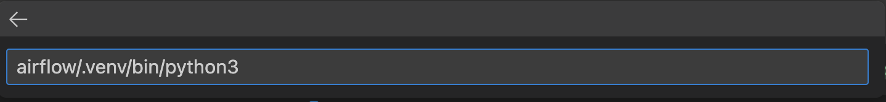
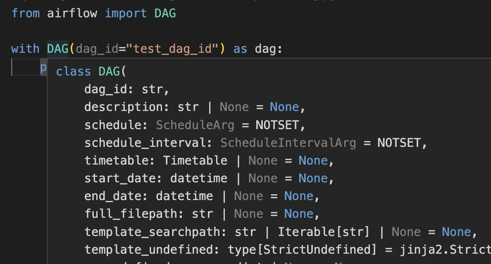

巷で話題の[uv](https://docs.astral.sh/uv/)を用いてVSCodeの開発環境を構築した記録です。  
  
  
uv でモジュールをインストールした後、モジュールのパラメータ予測、ソースコード参照が可能な環境を作成するための手順が少なかったので記事にしました。  
  
  
## uvとは  
Rust で書かれた非常に高速な Python パッケージおよびプロジェクトマネージャーです。  
  
<Bookmark href="https://docs.astral.sh/uv/" />
  
  
公式Doc以外にもuvについては話題になっていた以下の記事群を参照すると良いと思います。  
  
  
<Bookmark href="https://roboin.io/article/2024/02/19/rust-based-python-package-manager-uv/" />
  
  
<Bookmark href="https://gihyo.jp/article/2024/03/monthly-python-2403" />
  
  
<Bookmark href="https://qiita.com/kissy24/items/0c091bb5f12d697131ae" />
  
  
## プロジェクトへのuvの導入  

```shell  
❯ cd path/to/your/project  
❯ uv init  
Initialized project `your-project-name`  
// .venvの生成するため、syncを実行する  
❯ uv sync  
Creating virtual environment at: .venv  
❯ tree -L 1 -a  
.  
├── .env  
├── .gitignore  
├── .python-version  
├── .venv  
├── README.md  
├── hello.py  
├── pyproject.toml  
└── uv.lock  
  
  
// 任意のモジュールをプロジェクトに追加する  
❯ uv add apache-airflow  
```  
  
## VSCode上でuv環境を指定する  
  
  
VSCodeの画面の左下にあるPythonのバージョンを表す数字の部分をクリックし、「インタープリターのパスを選択」を選択。  
  
    
  
uvによって作成さらたpythonバイナリのパス（your/path/to/airflow/.venv/bin/python3）を入力  
  
  
  
上記操作を実施するとプロジェクトでuvのインタープリタが有効になり、モジュールが適切にimportされるようになります。  
  
  
画像のようにパラメータ補完やcommand+クリックによるソース参照機能が有効になっていることを確認できると思います。  
  


  
本格的にやりたい場合、以下のdevcontainerを用いた環境構築をするのが良さそう。  
  
    
<Bookmark href="https://zenn.dev/dena/articles/python_env_with_uv" />
  
  
## 【おまけ 】ruffを導入してコードフォーマットする  
  
  
uvの開発元と同じ Astral 社が開発している Python 用の Formatter, Linter である[ ruff](https://github.com/astral-sh/ruff/tree/main)を導入して利用してみます。  
  
  
```shell  
❯ uv add --dev ruff  
# 配下にあるpythonファイルをフォーマットする  
❯ ruff format .  
```  
  
  
uv addの際に`--dev` オプションをつけることでdevelopment dependency groupに依存関係を追加することができます。  
  
  
自分の環境では [lefthook](https://github.com/evilmartians/lefthook)のpre-commitのフックにruffを追加してコミット前にコードを整形するルールをプロジェクトに適用しています。  
  
