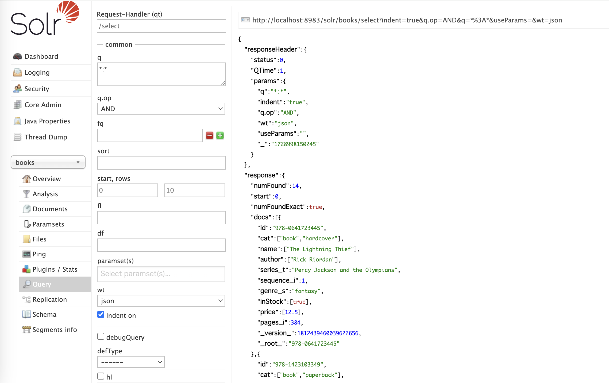

import { Bookmark } from "../../components/Bookmark";
  
# standaloneモードの**Apache SolrをDockerで動かしてみる**  
  
  
Apache Solrは全文検索ライブラリ Apache Licene(ルシーン)を用いた検索エンジンサーバーです。  
  
  
以下を参考にdockerを用いたstandaloneモードを動かしてみたのでその記録を紹介します。  
  
  
<Bookmark href="https://solr.apache.org/guide/solr/latest/deployment-guide/solr-in-docker.html" />
  
  
利用したdocker-compose.yaml  
  
  
```yaml  
version: '3'  
services:  
  solr:  
    image: solr  
    ports:  
     - "8983:8983"  
    volumes:  
      - data:/var/solr  
    command:  
      - solr-precreate  
      - gettingstarted  
volumes:  
  data:  
```  
  
  
起動コマンド  
  
  
```shell  
docker-compose up --build  
```  
  
  
起動すると以下からsolrの管理画面にアクセスできるようになります。  
  
  
[http://localhost:8983/solr/#/](http://localhost:8983/solr/#/) 
  
  
コンテナに入ってデータをインデックス（[参考書籍](https://gihyo.jp/book/2017/978-4-7741-8930-7)にあるtechproductsをインデックスする方法はなさそう）  
  
  
```shell  
docker exec -it solr-solr-1(それぞれコンテナ名) bash  
# tutorial用に用意されているデータの確認  
solr@09e993203df9:/opt/solr-9.7.0$ ls example/exampledocs/  
books.csv            ipod_video.xml     monitor.xml       sd500.xml         vidcard.xml  
books.json           manufacturers.xml  more_books.jsonl  solr-word.pdf  
gb18030-example.xml  mem.xml            mp500.xml         solr.xml  
hd.xml               money.xml          post.jar          test_utf8.sh  
ipod_other.xml       monitor2.xml       sample.html       utf8-example.xml  
  
# books用のcoreの作成  
solr@09e993203df9:/opt/solr-9.7.0$ bin/solr create -c books  
# books.jsonのインデックス  
solr@09e993203df9:/opt/solr-9.7.0$ bin/solr post -c books example/exampledocs/books.json  
```  
  
  
また、 Solritasの画面は V9では削除されているようです。  
  
  
> The VelocityResponseWriter and associated /browse UI is deprecated and will be removed in 9.0.    
> The functionality has been replaced by a 3rd party plugin available at [https://github.com/erikhatcher/solritas](https://github.com/erikhatcher/solritas).  
  
  
[https://solr.apache.org/guide/8_9/velocity-search-ui.html](https://solr.apache.org/guide/8_9/velocity-search-ui.html)  
  
  
サイドバーのcore selectorからbooksを選択し、queryを実行すると以下のように検索が成功することを確認。  
  
  
  
# Solrを扱う際に役立ちそうなメモ  
  
  
## サーチコンポーネントとサーチハンドラー  
  
  
Solrが提供する検索機能は、「サーチコンポーネント」と「サーチハンドラー」によって実現されている。  
  
  
クライアントからの検索リクエストはサーチハンドラが処理する。**サーチハンドラーには複数のサーチコンポーネントが登録されており、これらのサーチコンポーネントが互いに独立してリクエストを実行し**、最終的に処理結果を出力する。（サーチコンポーネントの種類によっては依存関係があり、完全に独立していない場合もある。）  
  
  
**Solrが提供するサーチコンポーネントの抜粋**  
  
  
| サーチコンポーネント名 | クラス名                    | 概要                         |  
| ----------- | ----------------------- | -------------------------- |  
| query       | solr.QueryComponent     | 検索結果を返す                    |  
| facet       | solr.FacetComponent     | ファセット情報を返す                 |  
| highlight   | solr.HighlightComponent | ハイライトスニペットを返す              |  
| suggest     | solr.SuggestComponent   | 検索キーワードのサジェスチョン（入力補完）を実現する |  
| …           |                         |                            |  
  
  
サーチコンポーネントをサーチハンドラーに登録するには、solrconfig.xmlのリクエストハンドラ定義内にあるfirst-components または last-components にコンポーネント名を列挙する  
  
  
```xml  
<requestHandler name="/サーチハンドラ名" class="solr.SearchHandler">  
  <arr name="first-components">  
    <str>サーチコンポーネント名</str>  
    <str>サーチコンポーネント名</str>  
  </arr>  
  <arr name="last-components">  
    <str>サーチコンポーネント名</str>  
    <str>サーチコンポーネント名</str>  
  </arr>  
</requestHandler>  
```  
  
  
fisrt-componentsに登録されたサーチコンポーネントはデフォルトで登録されているサーチコンポーネントの前に登録され、last-componentsは後に登録される。  
  
  
※ query, facet, highlight, 等、デフォルトで登録されているサーチコンポーネントは、明示的にsolrconfig.xmlにて登録する必要がない。  
  
  
## SolrCloudによるクラスタ運用  
  
  
Solrでは、上で紹介したstandalneモードではなく、SolrCloudモードで大規模な検索エンジン構築を行うことができる。  
  
  
SolrCloudはZooKeeperを利用して、ノードのステータス管理、設定ファイルの中央集中管理、分散インデクシング、レプリケーション、自動フェールオーバー、リーダーノード（マスターノード）の自動選出など、「単一障害点（Single Point Of Failure : SPOF）」を極力なくすための仕組みが取り込まれている。  
  
  
### 分散インデックス  
  
  
Solrでは大量のドキュメントを複数のノードで分けて扱うことが可能。1ノードあたりのストレージを小さく抑えつつ、理論的には巨大なインデックスを構築できる。その複数のノードに分散配置されたインデックスの一つをシャード（Shard）と言う。  
  
  
複数ノードでインデクシングを並列処理することにより、単位時間あたりのインデクシングのスループットを向上させることができる。（インデクシングのスループットは Documents Per Second :  DPSという。）  
  
  
### 分散検索  
  
  
分散インデックスを用いたSolrでは検索リクエストの際にすべてのシャードに同じ検索クエリを発行し、すべてのシャードの検索結果をマージしてクライアントへ検索結果として返却する分散検索が可能。  
  
  
複数のノードで小さなインデックスを並列に検索するため、大規模の大きなインデックス一つを検索する場合に比べて処理時間が短くなる。（単一インデックスからの検索に対して、分散検索ではマージ処理は別途必要になるが、大きなインデックスに対する検索コストに比べるとマージ処理は軽い処理）  
  
  
### レプリケーション  
  
  
Solrでは大量の検索トラフィックや、ハードウェア障害などによりノードがダウンした場合に備えて用意するインデックスのレプリカを作成することができる。  
  
  
レプリケーションは負荷分散とクラスタ全体の検索スループット向上させることができます。（検索スループットはQueries Per Second : QPS という。）  
  
  
## 参考文献  
  
  
<Bookmark href="https://gihyo.jp/book/2017/978-4-7741-8930-7" />
  
  
⚠️注意  
  
  
2024年10月現在はで Apache Solr 9.7.0  まで出ていますが、本書は2017年5月出版で Apache Solar 6.3.0 までの情報しか含みません。適宜読み替える必要があります。  
  
